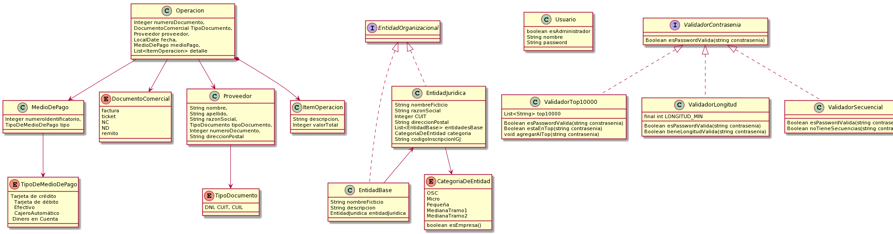

# 2020-vi-no-group-01

## Entrega 2 19/06/2020

### Diagrama de clases

## Entrega 1 15/05/2020

### Diagrama de clases

> ### Alternativas de solución - Algunas están siendo pensadas para próximas entregas: 
> - El validador podría ser una única clase estática que nos diga si una contraseña es válida.
> - El validador puede pensarse como un Singleton.
